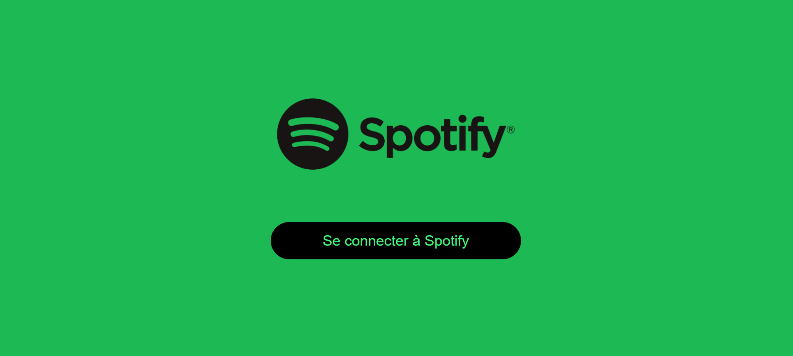

# Petit projet académique pour le module développement Front & Backend 

## Spotify Clone

***Pour réaliser ce projet, nous avons utilisé l'API Spotify**

### 1. Pour se connecter :
En utilisant l'API Spotify, nous sommes obligés d'utiliser un compte premium, cette connexion nous envoie vers les informations du compte
 

### 2. Getting Current User Playlist : 
To get the current user playlist, we go to the spotify for developers website and to the references : Get Current User's Playlists (https://developer.spotify.com/documentation/web-api/reference/get-a-list-of-current-users-playlists)
    * Use the url in the request sample in axios.get()   
